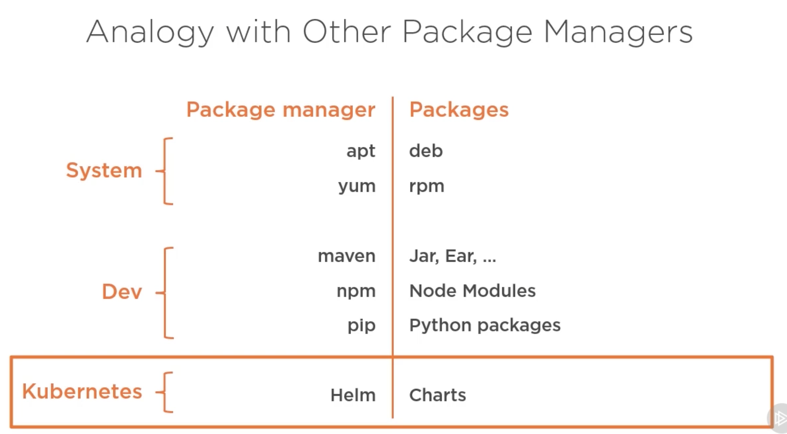
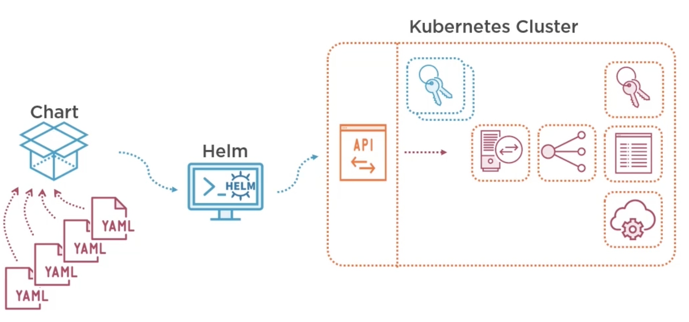
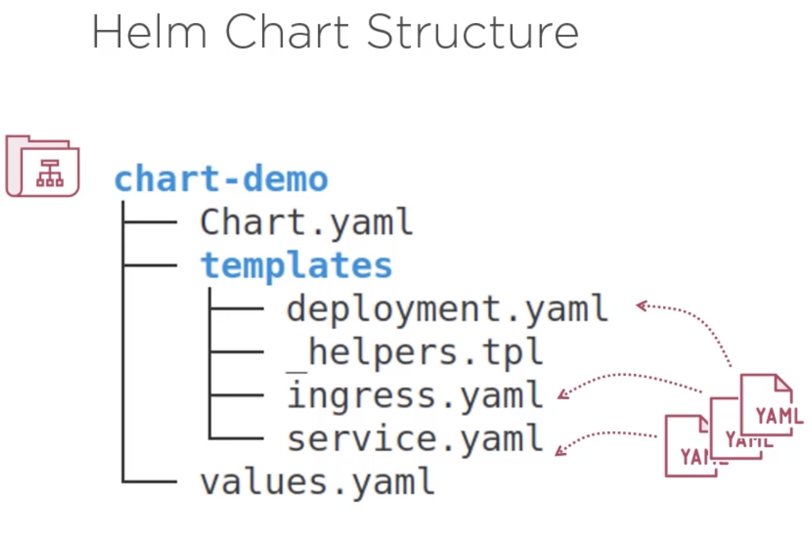

# HELM

Helm is a package manager for Kubernetes.

Chart is a definition of the application.
Releas is an instance of that chart.

Helm stores the released manifeste inside Kubernetes as secrets.

In Kubernetes you can group resources in virtual clusters called namespaces!

## Helm Charts

- Chart folder can be compressed as an archive.
- Folder name has the name of the chart.
- Chart properties are stored in Chart.yaml (There can be found: chart name, version & other metadata)
- Chart folder has templates subfolder contains K8S object definition files. There are not raw yaml files instead there are customizable templates with placeholders that are replaced by values using helper functions (see \_helprs.tpl inside of templates)
